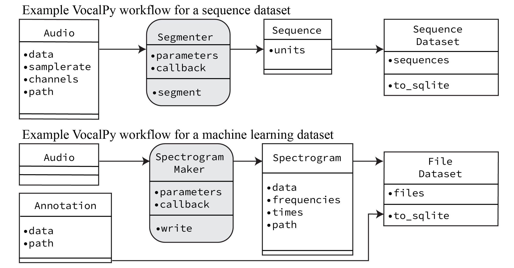
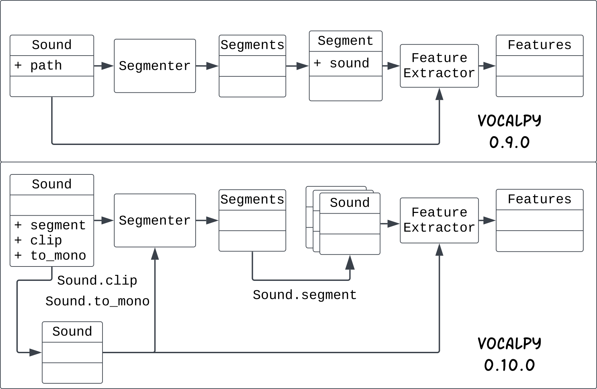
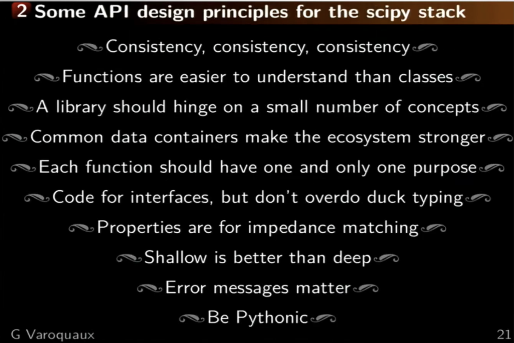

In this post I'm going to talk about domain-driven design, 
and how I've been using that approach when developing VocalPy.
In the [last post on VocalPy version 0.10.0](../2025-02-14-vocalpy-0.10.0/index.qmd), 
I made a point of saying that I would only describe new features, 
and I'd save discussion of how I designed them for another post.
Well, here's that post.

I'm writing this post for two audiences. 
The first is people who are interested in using and/or contributing 
to VocalPy, that want to better understand its design.
The second audience is anyone who is interested 
in how to design software for scientists, software engineers, 
and everyone who sits somewhere along the spectrum between those two job titles.

You might think I should save my thougts on this until such time 
that VocalPy actually supports a community of researchers studying acoustic communication. 
Instead, I should be busy proving this software is actually useful: 
writing more docs to show how it's used, adding a bunch of features, 
recruiting new users and other maintainers. Fair point.

But I feel like it's worth taking just a little bit of time to justify 
my approach in words, to claim there's a method to my madness. 
That's what I said I'd do 
[in the first post on this blog](../2025-02-11-developers-blog/index.qmd) after all.

First I'll [introduce domain-driven design](#what-is-DDD). 
Then I'll describe [how I've used domain-driven design when developing VocalPy](#domain-driven-vocalpy). 
To wrap up, I'll relate [domain-driven design to scientific Python more generally](#DDD-and-scipy).

## What is domain-driven design? {#what-is-DDD}

If you go and read the [Forum Acusticum proceedings paper](https://dael.euracoustics.org/confs/fa2023/data/articles/000403.pdf), 
"Introducing VocalPy", you'll see that I name-drop domain-driven design there.
But I don't talk about it a lot, since you only get so much space in a proceedings paper.
Please consider this a longer, much more informal, version of what I wrote there. 

For this post to make sense, I have to introduce domain-driven design.
I also need to repeat myself a little -- I wrote about this 
[on my personal blog](https://blog.nicholdav.info/posts/2026-03-06-domain-driven-design/).
If you came here from there, feel free to skip down to where I start talking about 
[how I've used domain-driven design when developing VocalPy](#domain-driven-vocalpy).

What is domain-driven design, and why should you care about it?
Sometime in 2022-2023, I read 
[Domain-Driven Design](https://www.domainlanguage.com/ddd/) by Eric Evans, and I got really excited about it.
If you do nothing else, read the first chapter of Evans' book, where he relates the story 
of how he worked with some electrical engineers to design software they would use to 
design printed circuit boards (AKA PCBs).

At the beginning, he makes mistakes.
He tries to understand their jargon word-for-word.
Then he asks them to specify in detail what they think the software should do.
Neither of those approaches were ever going to work well. 
Finally he hits upon the idea of asking them to draw out diagrams of their process 
and how the software should interact with it.
These are simple, rough box and arrow sketches as he shows.

Notice what is happening here: this is not just a developer creating a UML diagram to show to other developers. 
This is software engineers and domain experts developing a pidgin language together. 
They use this pidgin to talk about the domain problem they are trying to solve with software.

It's an interesting story for a couple of reasons. First of all, you have a feeling that he is 
almost an anthropologist, going into this unfamiliar tribe of electrical engineers 
so he can learn their culture.
I think this is a familiar feeling for anyone who has tried to translate 
some real-world domain into software, even if it's part of a culture they feel like they belong to.
Second, you really get a feel for his process. 

If you have ever gone through the process of designing software for some real-world domain, 
I bet the story really resonates with you.

## How I've used domain-driven design when developing VocalPy {#domain-driven-vocalpy}

I happened to read Evans' book at the same time that I had been sketching out some initial ideas for VocalPy.
You can see some of these sketches here: 
<https://github.com/vocalpy/vocalpy/issues/19>

If you were to click through to the library's docs, you might notice that these bear little resemblance to VocalPy now.
I think this is actually a good thing -- more on that below.
(You might also notice at the time I was thinking of calling it `vocles` -- 
everyone please clap for me showing enough restraint for once in my life to not make a bad pun.)

I don't actually remember which came first: these sketches, or me reading the book.
I think that I actually drew the sketches first, and had them sitting around on a desk forever, 
until finally it hit me that I should add them to the repo to document my design process.
And then reading this part of Evans' book really made me think 
that drawings like this should be integral to the design process. 
In a previous draft of this post,  I urged people to put these design diagrams 
into the docs for their software. 
I'm revising because I'm less convinced that would help users, 
although personally as a developer I would really be interested 
to see *more* **design** diagrams.
I would argue that these drawings should be part of the [theory](https://cekrem.github.io/posts/programming-as-theory-building-naur/) 
behind your scientific software.

Ok, now you have an idea of what domain-driven design is.
You might ask yourself, have I done anything with this? 
Or do I just like pontificating into the void about ideas from computer science and tech books?
Even if I haven't gone back to finish the book and immersed myself in every detail,
the core idea has really stuck with me. 
Going back to that [Proceedings paper](https://dael.euracoustics.org/confs/fa2023/data/articles/000403.pdf) 
where I first introduced VocalPy, you can see where I included a similar drawing, cleaned up for a paper.

Even by the time I got to this first Proceeding paper, 
the design of the library had evolved.
But this is a *good thing* --- I did exactly what Evans prescribed, 
and continued to iterate on the design of the package.
Doing so made me realized which parts were actually useful, 
that I wanted to retain in the core.
I think sketching things out has also helped me understand 
why the things I ended up taking out are still useful, 
just not in the way I had thought at first.
The library at first was very focused on the idea of capturing a dataset 
of specific file types, and then being able to save this dataset in the form of a SQLite file.
You can see where I was really focused on treating the dataset as if it were part of an app, 
like in the architecture book.
I do think this is still important, 
but it is *not* the core of what the library does -- I realized later that the core data types 
needed to be things like sounds, spectrograms, annotations, the things 
that a researcher studying animal communication and using bioacoustics would be talking about.
So, basically, I did the anthropological exercise, as in Chapter 1 of Evans' book, 
but instead of doing it with other people, 
I started by doing it with the part of my brain that claims to know things about acoustic communication.
(I have since engaged with other people who actually know these things and can give me good feedback.)

You can also see how I've continued this way, looking at the diagram I show at the top of that 
[last post on VocalPy version 0.10.0](../2025-02-14-vocalpy-0.10.0/index.qmd)

Making these diagrams helped me understand how to change the key workflow in VocalPy. 
Basically, I realized that I could remove the abstraction of a single `Segment`, 
and replace it with a `Sound.segment` method. 
That `segment` method takes in the output of a segmenting algorithm, represented as 
an instance of `Segments`, and then returns a list of `Sound`s, one for each segment.  
This lets me still preserve the outputs of a segmenting algorithm for downstream analysis, 
while simplifying the library.  
The simplification minimizes the cogitive load on users and developers, 
who no longer have to remember how a `Segment` is related to `Segments` and how to get 
a `Sound` from a `Segment`.
(For more details on what changed, please see [that post](../2025-02-14-vocalpy-0.10.0/index.qmd).
Again, realizing that I could make this change by sketching out the workflows 
is, in my understanding at least, exactly the kind of iterative development process 
that Evans advocates for in his book.

## Domain-driven design and scientific Python {#DDD-and-scipy}

Having read this, you might feel like: "Cool story bro, 
but domain-driven design is not a new idea. I already do that." 
I talk about that more in [that post on my personal blog](https://blog.nicholdav.info/posts/2026-03-06-domain-driven-design/).
To sum it up, here I'll say, sure, domain-driven design is not a new idea 
(as Evans himself acknowledges right at the start of his book).
But I also want to use what I've said about VocalPy to make the case 
once more for why I think we should be doing more of it.
 
Here I want to link to a talk I gave, fittingly titled "VocalPy as a case study of domain-driven design in scientific Python".
(Huge thank you to the [DoePy exchange](https://meetup.doepy.org/) and [Don't Use this Code](https://www.dontusethiscode.com/) 
for inviting me and giving me space to talk through these things with a sympathetic community.)

<iframe width="560" height="315" src="https://www.youtube.com/embed/PtTegIM6m1o?si=A6MLDiXgRoDnhuTR" title="YouTube video player" frameborder="0" allow="accelerometer; autoplay; clipboard-write; encrypted-media; gyroscope; picture-in-picture; web-share" referrerpolicy="strict-origin-when-cross-origin" allowfullscreen></iframe>

One of the things I explain 
in the talk is how my attempt to apply domain-driven design has 
led me to do things that *maybe* clash with some recommendations 
for programming in scientific Python. 

Compare for example with Gaël Varoquaux's recommendations in this SciPy 2017 talk:

<iframe width="560" height="315" src="https://www.youtube.com/embed/eVDDL6tgsv8?si=oOBxq0spvx4LNRw-&amp;start=1383" title="YouTube video player" frameborder="0" allow="accelerometer; autoplay; clipboard-write; encrypted-media; gyroscope; picture-in-picture; web-share" referrerpolicy="strict-origin-when-cross-origin" allowfullscreen></iframe>

Crucially, here from slide 21 are Gaël's API design principles for the scipy stack:

The main thing I am doing that would be considered a no-no, according to those principles, is: 
*not* restricting myself to using the core types of the scientific 
Python stack, e.g., the NumPy array and the pandas DataFrame. 
Instead, I have a core set of types in terms of the domain, 
bioacoustics and acoustic communication in animals: 
`Sound`s, `Spectrogram`s, (acoustic) `Feature`s, etc. 
These types are basically data containers, where the 
underlying array or dataframe is just one attribute away, 
often literally named `data`, i.e., `Sound.data`. 
My argument is that this is a small price to pay, 
if it makes the code more immediately readable 
to other researchers in my domains of interest.

There are other recommendations that Gaël makes in his talk 
that I should probably take to heart. 
I can think of some classes in VocalPy that [probably should just be functions](https://youtu.be/o9pEzgHorH0?si=zCRfP9qO1W7lC1Eq).
Please don't think I'm claiming that domain-driven design 
is some magic method you can follow to produce correct research code.
I definitely do not claim to be any smarter or more experienced of a developer than Gaël Varoquaux. 
This is just me trying to wrap my head around designing software for different domains, 
and how to reconcile that with different programming paradigms. 
(Yes, this is foreshadowing for another blog post.)

So the last thing I will say is, 
sometimes when my collaborators and I try to 
explain what we're doing with the design of VocalPy 
to other researchers who work with scientific Python, 
it elicits an impromptu lecture: about 
how object-oriented programming was all a big OOPs, 
that everyone learned the hard way that lots of hidden state 
in classes and class hierarchies is bad, 
especially for scientific software, 
and we are about to repeat the mistakes of the past. 
So: let it be known that I am aware of this. 
My link to Gaël's talk above shows that I have got the message straight from the horse's mouth 
(I do not mean to imply that Gaël is a horse).
You don't need to lecture me. 
I agree with you already. 
And *also*, I think scientific Python can have a little bit of class, 
as a treat. Or functions, if functions make more sense. 
*As long as* those classes, or functions, or *whatever*, 
give domain experts a tool for their domain that is *easier* for them to learn, reason about, and work with. 
Domain-driven design provides us *one* way to work towards software tools that meet this goal. 
I tried to give some concrete examples supporting that claim in [the post on my personal blog](https://blog.nicholdav.info/posts/2026-03-06-domain-driven-design/),
and I hope that here I've given you some idea of how I use domain-driven design to develop VocalPy, 
and more generally what domain-driven design for research code can look like.
